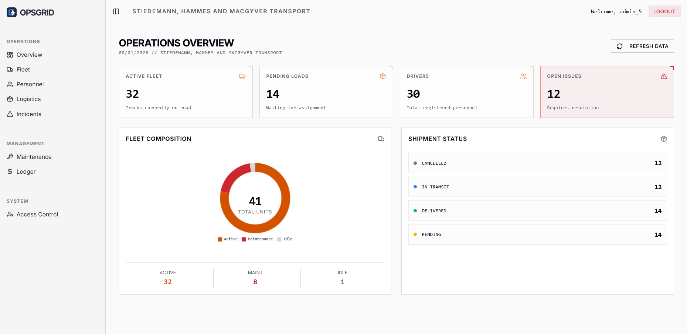
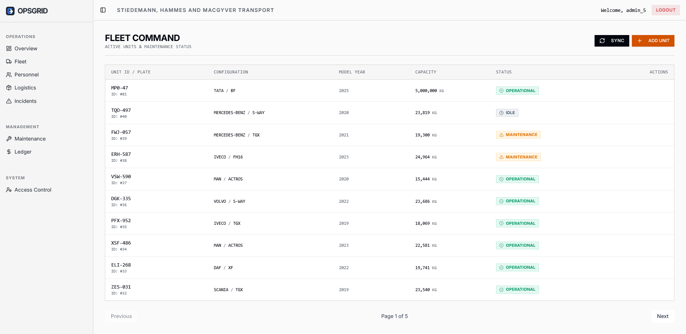
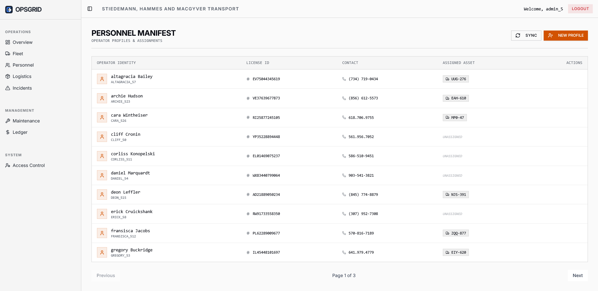
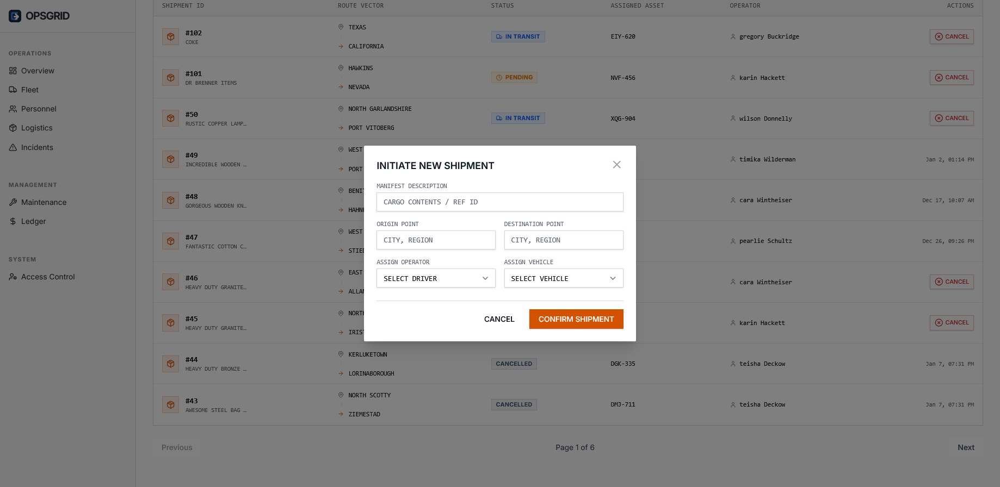

<div align="center">

<h1>OpsGrid</h1>
<p><strong>Next-Gen Logistics Command & Control Platform</strong></p>

<p>


</p>
</div>

<br />

📡 System Overview

OpsGrid is a multi-tenant enterprise logistics platform designed to bridge the gap between field operations and command-level decision-making. Unlike standard tracking tools, OpsGrid provides a unified "Single Pane of Glass" interface for managing fleet readiness, personnel assignments, and shipment lifecycles.

The system features a Tactical UI design language optimized for high-density data visualization and quick action, integrated with Generative AI for predictive diagnostics.

📸 Interface Visuals

<table>
<tr>
<td width="50%">

<div align="center"><b>Command Dashboard</b>


Real-time fleet metrics & status</div>
</td>
<td width="50%">

<div align="center"><b>Fleet Operations</b>


Vehicle assignment & maintenance</div>
</td>
</tr>
<tr>
<td width="50%">

<div align="center"><b>Staff Management</b>


Users details and info</div>
</td>
<td width="50%">

<div align="center"><b>Logistics Manifest</b>


Active shipments & route vectors</div>
</td>
</tr>
</table>

## Core Modules

### 1. Operations Command (Dashboard)
* **Tactical Overview:** High-level metrics on fleet utilization, driver availability, and load status.
* **Real-time Alerts:** Immediate visual indicators for stalled shipments or maintenance requirements.

### 2. Fleet & Logistics
* **Asset Registry:** Detailed tracking of vehicle specifications, VINs, and operational status (`WORKING`, `IN_REPAIR`, `IDLE`).
* **Shipment Vectors:** End-to-end lifecycle management from `PENDING` to `DELIVERED`.
* **Financial Ledger:** Integrated cost tracking (Income vs. Expenses) with category breakdowns (Fuel, Maintenance, Tolls).

### 3. Personnel Management (RBAC)
Strict Role-Based Access Control ensures data security:
* **Admin (Command):** Full system provisioning, user management, and sensitive data access.
* **Manager (Officer):** Operational control over fleets, shipments, and incident resolution.
* **Driver (Operator):** Restricted "Service Record" view. Can only view assigned assets, update shipment status (Start/Complete), and report incidents.

### 4. Intelligent Diagnostics (AI)
* **Integration:** Google Gemini 1.5 Flash.
* **Function:** Automatically analyzes driver-reported text (e.g., "Engine knocking sound") to provide probable causes and recommended mechanic actions immediately.

---

## Tech Stack

**Backend Infrastructure**
* **Framework:** Spring Boot 3 (Java 21)
* **Security:** Spring Security + JWT (Stateless Authentication)
* **Database:** PostgreSQL
* **ORM:** Hibernate / Spring Data JPA
* **API:** RESTful Architecture

**Frontend Interface**
* **Framework:** React (Vite)
* **Styling:** Tailwind CSS + Shadcn UI (Custom "Tactical" Theme)
* **State:** React Context API
* **Icons:** Lucide React

---

## Deployment & Setup

### Prerequisites
* JDK 21+
* Node.js 18+
* PostgreSQL 14+

### 1. Database Setup
Create a PostgreSQL database named `opsgrid_db`.

### 2. Backend Configuration
Navigate to `backend/src/main/resources/application.properties` and configure:
```properties
spring.datasource.url=jdbc:postgresql://localhost:5432/opsgrid_db
spring.datasource.username=your_db_user
spring.datasource.password=your_db_password
app.jwtSecret=your_secure_random_secret_key
```
### 3. Frontend Configuration
Create a .env file in the frontend root:

```
VITE_API_BASE_URL=http://localhost:8080/api/v1
VITE_GEMINI_API_KEY=your_google_gemini_api_key
```

### 4. Build & Run

Backend:
```
Bash

cd backend
./mvnw spring-boot:run
```

Frontend:
```
Bash

cd frontend
npm install
npm run dev
```

### Security Protocol

* **Password Policy**: Users are invited via secure token links and set their own passwords.

* **Route Protection**: Frontend routes are protected via Higher-Order Components ensuring drivers cannot access Admin/Manager panels.

* **API Security**: All endpoints are secured with method-level authorization (@PreAuthorize).

  ---

<div align="center"> <p>Engineered for reliability.</p> <p>© 2026 OpsGrid Systems.</p> </div>


